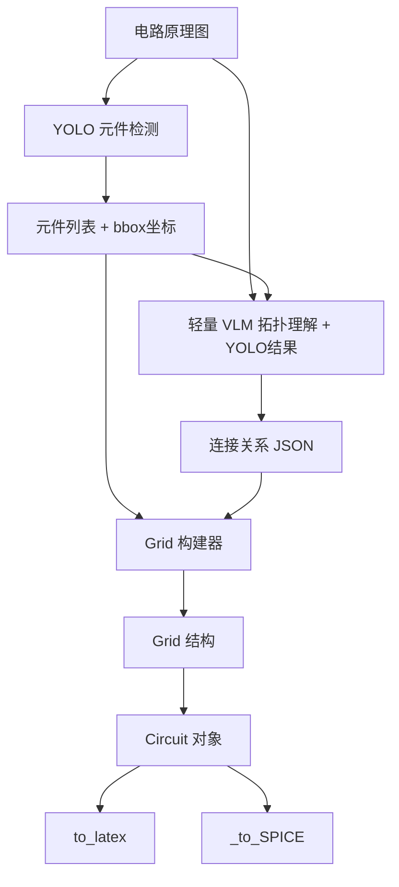

# 电路图 → LaTeX/SPICE 转换 Pipeline 设计

## 整体架构



## 模块设计

### 模块1: YOLO 元件检测器

**输入**: 电路原理图图像

**输出**: 元件列表 + 坐标

```python
# YOLO 输出格式
{
  "elements": [
    {"id": "R1", "type": "resistor", "bbox": [x1,y1,x2,y2], "center": [cx,cy]},
    {"id": "V1", "type": "voltage_source", "bbox": [...], "center": [...]},
    {"id": "R2", "type": "resistor", "bbox": [...], "center": [...]}
  ],
  "image_size": [width, height]
}
```

**需要训练的类别**:

- **基本元件**: resistor, capacitor, inductor, voltage_source, current_source
- **受控源**: vccs, vcvs, cccs, ccvs
- **三极管**: transistor_npn, transistor_pnp
- **其他**: ground, node, diode, opamp

### 模块2: 轻量 VLM 拓扑理解

**输入**: 电路原理图 + YOLO检测结果

**输出**: 连接关系 JSON

```python
# VLM 输入格式（包含YOLO检测信息）
{
  "image": "circuit.png",  # 电路图路径
  "detected_elements": [   # YOLO检测结果
    {"id": "R1", "type": "resistor", "bbox": [x1,y1,x2,y2], "center": [cx,cy]},
    {"id": "Q1", "type": "transistor_npn", "bbox": [x1,y1,x2,y2], "center": [cx,cy]},
    {"id": "V1", "type": "voltage_source", "bbox": [...], "center": [...]}
  ]
}

# VLM 输出格式（支持边上元件和节点上元件）
{
  "grid_size": {"m": 3, "n": 4},
  "nodes": [
    {"id": 0, "grid_pos": [0, 0], "is_ground": true},
    {"id": 1, "grid_pos": [0, 1]},
    {"id": 2, "grid_pos": [0, 2]},
    {"id": 3, "grid_pos": [1, 1]}  # 三极管基极节点
  ],
  "edge_components": [  # 边上元件（传统元件）
    {"type": "resistor", "label": "R1", "value": 100, "unit": "k",
     "from_node": 1, "to_node": 2, "orientation": "horizontal"}
  ],
  "node_components": [  # 节点上元件（三极管等）
    {"type": "transistor_npn", "label": "Q1",
     "base_node": 3, "collector_node": 1, "emitter_node": 2,
     "orientation": "up"}  # 朝上
  ]
}
```

### 模块3: Grid 构建器

**核心逻辑**: 将 YOLO坐标 + VLM拓扑 合并成 Grid 结构，支持边上和节点上元件

```python
class GridBuilder:
    def __init__(self, yolo_result, vlm_result):
        self.elements = yolo_result["elements"]
        self.edge_components = vlm_result.get("edge_components", [])
        self.node_components = vlm_result.get("node_components", [])
        self.nodes = vlm_result["nodes"]
        self.grid_size = vlm_result["grid_size"]

    def build_grid(self) -> dict:
        """
        1. 根据 grid_size 初始化数组
        2. 根据 bbox 计算 vertical_dis, horizontal_dis
        3. 处理 edge_components：填充 vcomp_*, hcomp_* 数组
        4. 处理 node_components：为三极管等器件创建特殊节点
        5. 返回完整 Grid JSON
        """
        pass

    def _add_transistor_to_grid(self, transistor):
        """
        处理三极管：
        - 在基极节点位置添加三极管元件
        - 连接基极、集电极、发射极到相应节点
        - 根据orientation调整绘制方向
        """
        pass

    def to_circuit(self) -> Circuit:
        """将 Grid JSON 转换为 Circuit 对象"""
        grid = self.build_grid()
        return Circuit(**grid)
```

### 模块4: 格式转换（复用现有代码）

直接使用 `grid_rules.py` 中的：

- `Circuit.to_latex()` → LaTeX 输出
- `Circuit._to_SPICE()` → SPICE 输出

## 文件结构

```
ppm_construction/
├── data_syn/
│   ├── grid_rules.py          # 现有：Grid↔LaTeX/SPICE
│   └── generate.py            # 现有：随机生成
├── circuit_recognition/       # 新增
│   ├── __init__.py
│   ├── yolo_detector.py       # YOLO 元件检测
│   ├── vlm_topology.py        # VLM 拓扑理解
│   ├── grid_builder.py        # Grid 构建器
│   ├── pipeline.py            # 主 Pipeline
│   └── prompts/
│       └── topology_prompt.txt # VLM prompt 模板
└── models/
    └── circuit_yolo.pt        # 训练好的 YOLO 模型
```

## 实现步骤

### 步骤1: 创建 grid_builder.py

- 实现 `GridBuilder` 类
- 实现坐标映射算法（bbox → grid坐标）
- 实现数组填充逻辑

### 步骤2: 创建 vlm_topology.py

- 设计 VLM prompt（让输出格式稳定）
- 实现 JSON 解析和验证
- 支持多种 VLM 后端（OpenAI/Claude/本地）

### 步骤3: 创建 yolo_detector.py

- 封装 YOLO 推理
- 实现元件分类映射
- 输出标准化格式

### 步骤4: 创建 pipeline.py

- 串联所有模块
- 错误处理和回退策略
- 提供简单 API

## VLM Prompt 设计（关键）

```text
你是一个电路分析专家。请分析这张电路图和检测到的元件信息，输出 JSON 格式的拓扑结构。

输入信息：
- 电路原理图
- YOLO检测到的元件列表（包含位置信息）

分析要求：
1. 识别所有节点，用网格坐标表示位置
2. 识别所有元件及其连接关系
3. 标注接地节点
4. 特别注意多端子元件（如三极管）的连接方式

元件分类：
- 边上元件（两端）：resistor, capacitor, inductor, voltage_source, current_source, vccs, vcvs, cccs, ccvs, diode
- 节点上元件（多端）：transistor_npn, transistor_pnp, opamp

输出格式：
{
  "grid_size": {"m": 行数, "n": 列数},
  "nodes": [
    {"id": 0, "grid_pos": [x, y], "is_ground": false}
  ],
  "edge_components": [
    {"type": "resistor", "label": "R1", "value": 100, "unit": "k",
     "from_node": 1, "to_node": 2, "orientation": "horizontal"}
  ],
  "node_components": [
    {"type": "transistor_npn", "label": "Q1",
     "base_node": 3, "collector_node": 1, "emitter_node": 2,
     "orientation": "up"}
  ]
}
```

## 使用示例

```python
from circuit_recognition import CircuitPipeline

pipeline = CircuitPipeline(
    yolo_model="models/circuit_yolo.pt",
    vlm_backend="openai",  # 或 "claude", "local"
)

# 从图像转换
result = pipeline.convert("circuit.png")

# 获取输出
latex_code = result.to_latex()
spice_code = result.to_spice()
grid_json = result.to_grid_json()
```

## 三极管绘制方案

三极管等三端子元件无法简单放在一条边上，需要特殊处理：

### 方案设计

1. **节点放置**: 三极管本体放在特定节点位置
2. **引脚连接**: 通过短路线连接三极管的三个引脚到相应节点
3. **方向处理**: 根据orientation参数调整三极管朝向

### 具体实现

```python
# 三极管在Grid中的表示
{
  "type": "transistor_npn",
  "label": "Q1",
  "grid_pos": [1, 1],  # 放置位置
  "orientation": "up",  # 朝向：up/down/left/right
  "connections": {
    "base": {"node": 5, "wire_length": 1},      # 基极连接到节点5
    "collector": {"node": 2, "wire_length": 1}, # 集电极连接到节点2
    "emitter": {"node": 8, "wire_length": 1}   # 发射极连接到节点8
  }
}
```

### LaTeX绘制

使用CircuitTikZ的`npn`或`pnp`元件，结合位置调整和连接线绘制。

```