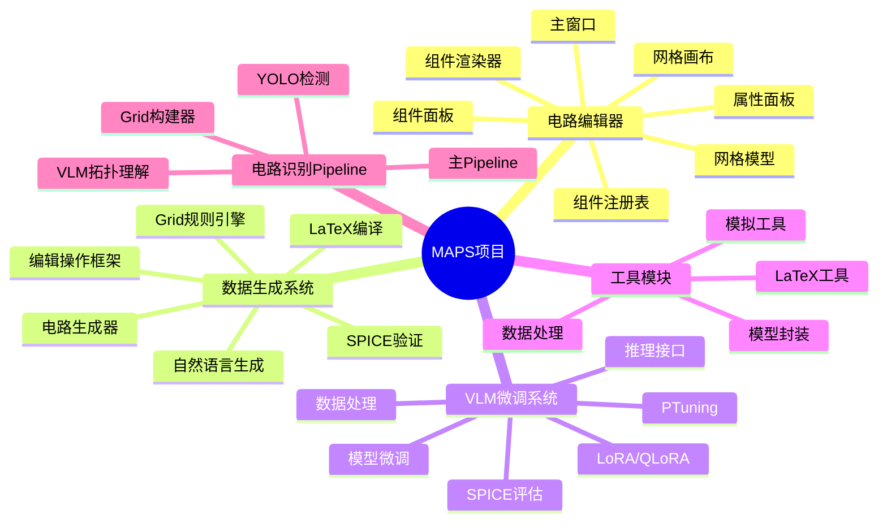
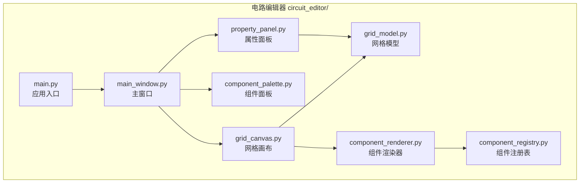
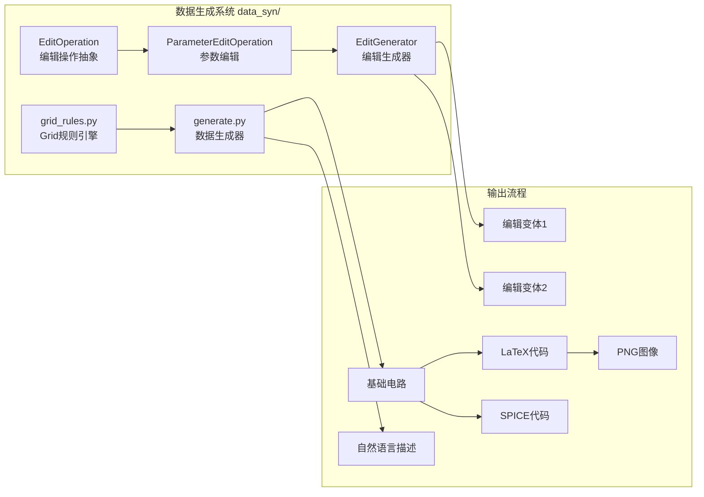
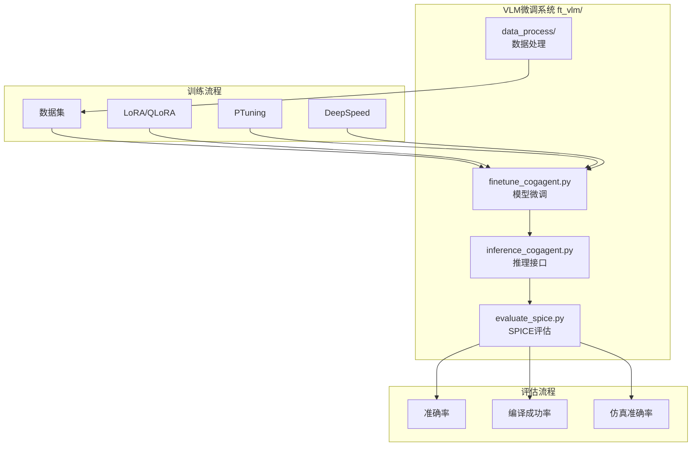
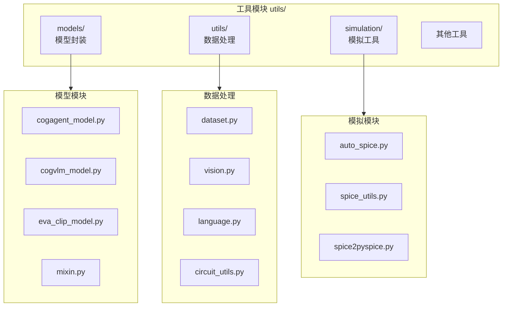
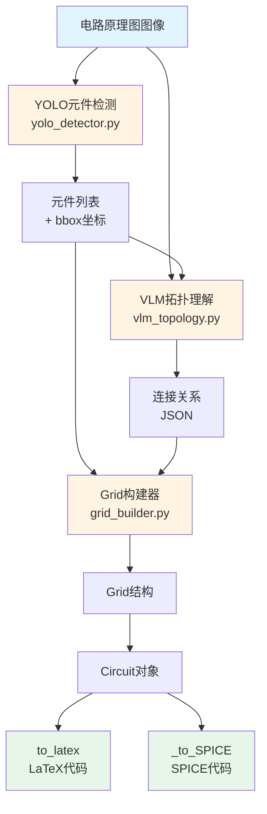
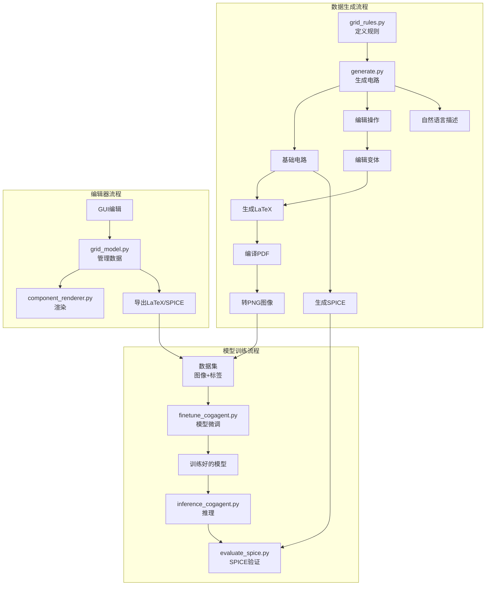
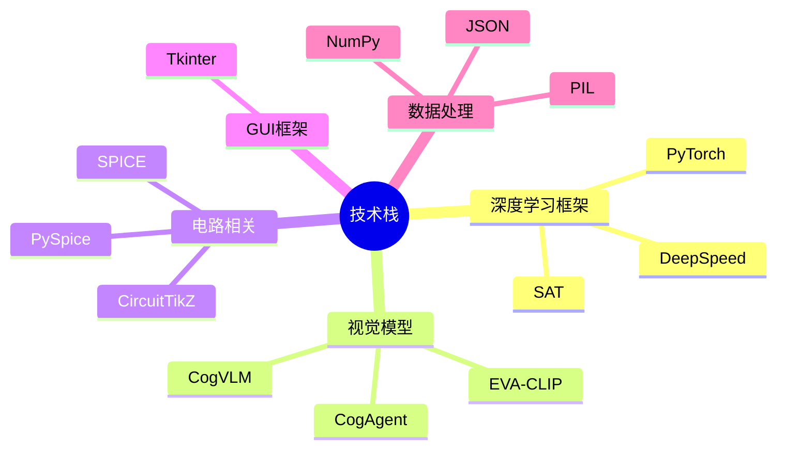
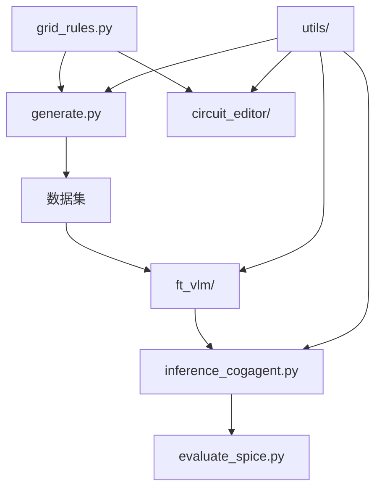

# MAPS项目工作思维导图

## 项目概述

**MAPS** (Multi-modal Reasoning in Physical Science) - 多模态物理科学推理项目，专注于电路图理解、生成和转换。

---

## 整体架构图



---

## 核心模块详细架构

### 1. 电路编辑器模块



**功能特性**:
- ✅ 可视化编辑电路网格
- ✅ 添加/删除边和元件
- ✅ 设置元件类型和参数
- ✅ 导出LaTeX和SPICE格式

---

### 2. 数据生成系统



**数据流程**:
```
基础电路生成 → 应用编辑操作 → 生成变体 → 导出LaTeX/SPICE → 编译渲染
```

**输出结构**:
```
edit_dataset/
  ├── circuit_id/
  │   ├── base/          # 基础电路
  │   ├── edit_1/        # 编辑变体1
  │   ├── edit_2/        # 编辑变体2
  │   └── metadata.json  # 元数据
```

---

### 3. VLM微调系统



**训练配置**:
- 支持DeepSpeed分布式训练
- 可训练参数：encoder, cross_attention, linear_proj, mlp.vision, rotary.vision, vit等
- 学习率缩放策略

---

### 4. 工具模块



---

### 5. 计划中的电路识别Pipeline



**状态**: 🚧 规划中

---

## 数据流和依赖关系

### 完整数据流图



---

## 技术栈



---

## 项目特点

1. **多模态**: 结合视觉和语言理解
2. **双向转换**: Grid ↔ LaTeX ↔ SPICE
3. **可扩展**: 支持多种编辑操作类型
4. **验证机制**: SPICE仿真验证代码正确性
5. **可视化**: GUI编辑器提供直观的电路编辑体验

---

## 未来规划

1. ✅ 实现电路识别Pipeline（YOLO + VLM）
2. ✅ 支持更多元件类型
3. ✅ 增强拓扑理解能力
4. ✅ 优化模型性能
5. ✅ 扩展数据集规模

---

## 文件结构总览

```
MAPS-master/
├── ppm_construction/
│   ├── circuit_editor/          # 电路编辑器
│   │   ├── main.py
│   │   ├── views/               # 视图层
│   │   ├── models/              # 数据模型
│   │   └── registry/            # 组件注册
│   ├── data_syn/                # 数据生成
│   │   ├── grid_rules.py        # Grid规则引擎
│   │   ├── generate.py          # 数据生成器
│   │   └── data/                # 生成的数据
│   └── ft_vlm/                  # VLM微调
│       ├── finetune_cogagent.py
│       ├── inference_cogagent.py
│       ├── evaluate_spice.py
│       └── data_process/       # 数据处理
├── utils/                       # 工具模块
│   ├── models/                  # 模型封装
│   ├── utils/                   # 数据处理
│   └── simulation/              # 模拟工具
└── data/                        # 数据集
```

---

## 模块间依赖关系



---

*最后更新: 2025年*
