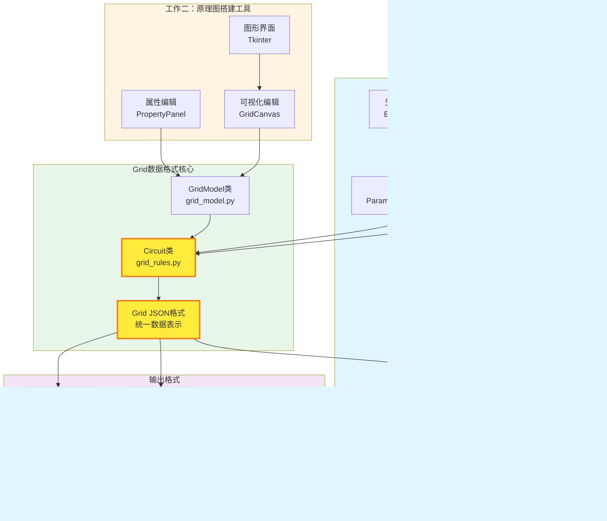
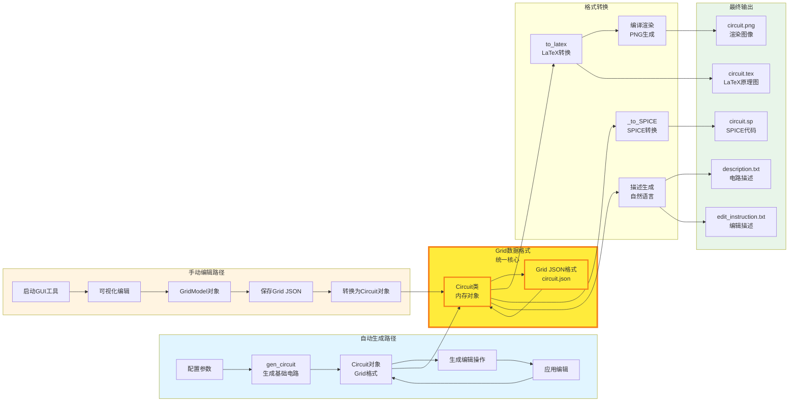
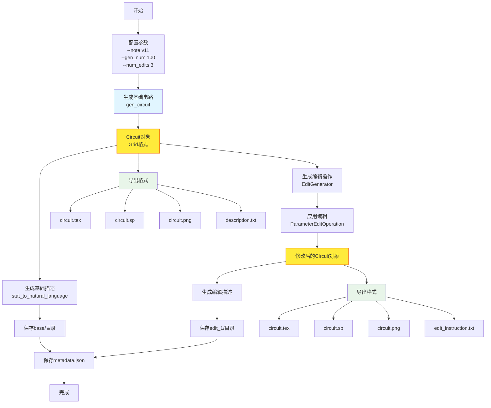
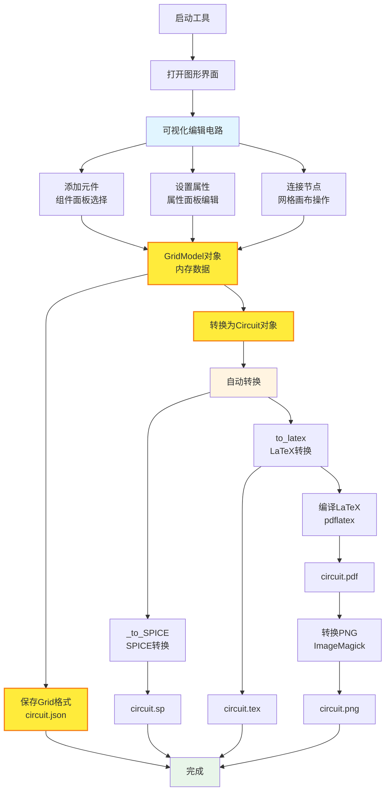
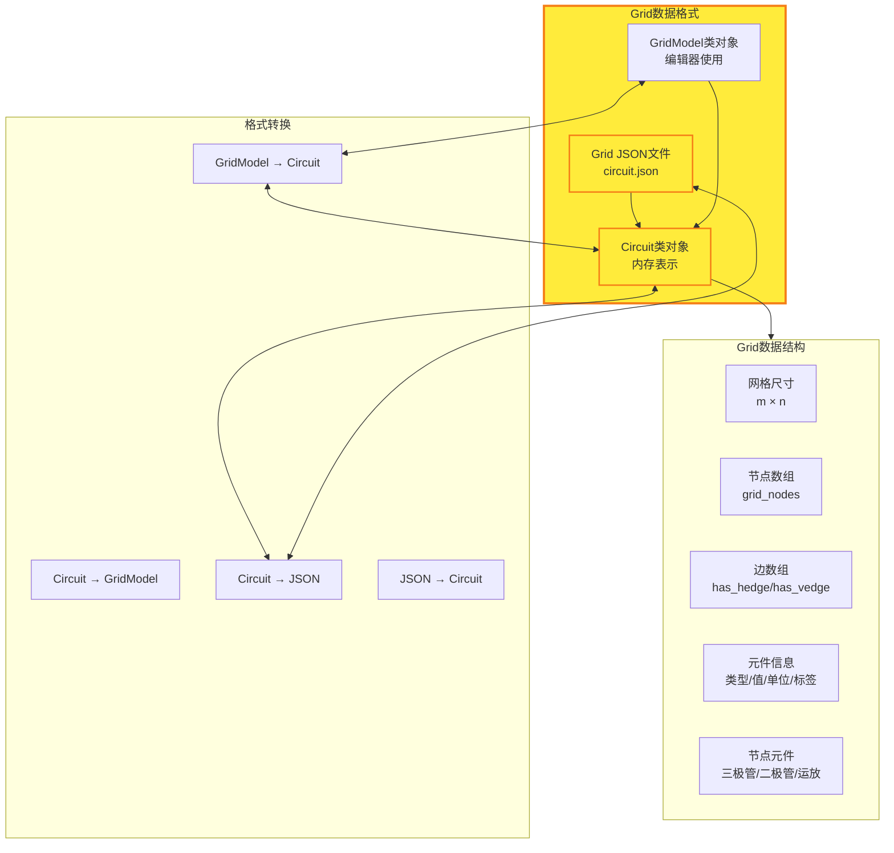
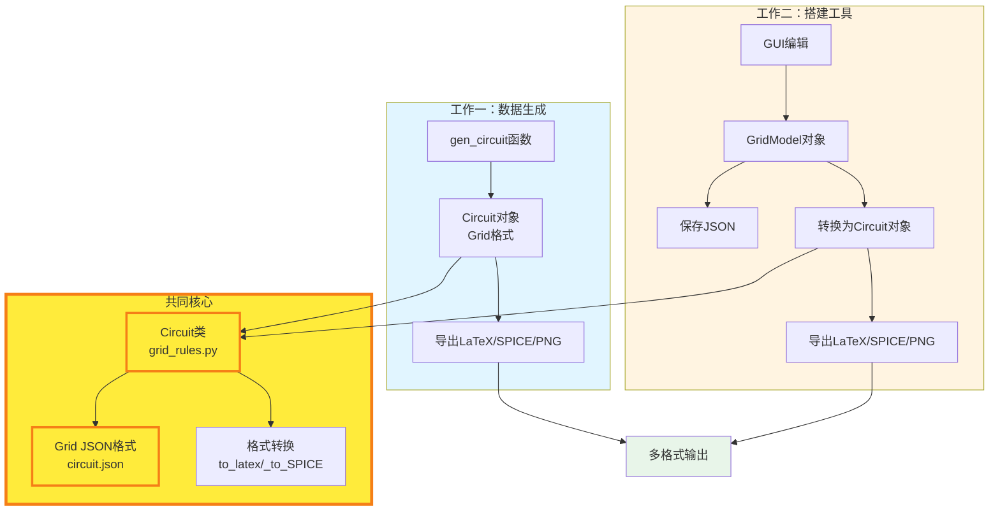
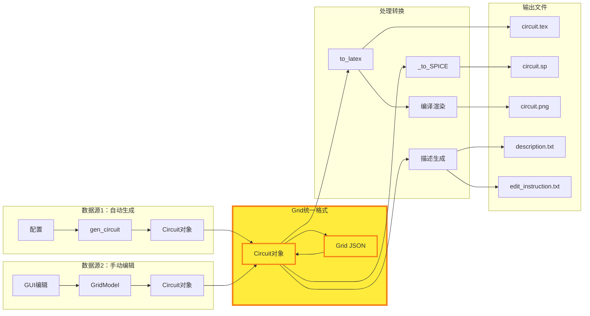
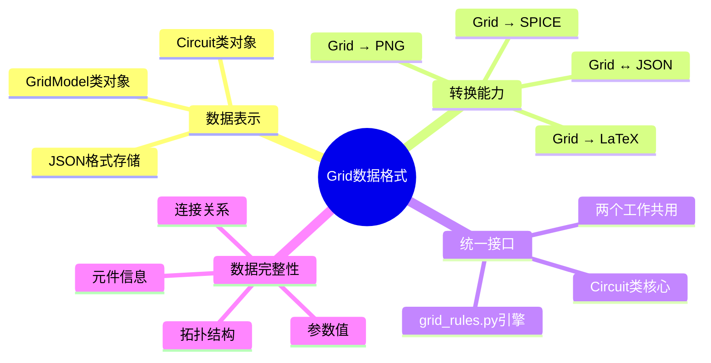

# MAPS项目工作介绍思维导图

## 核心工作架构（统一视图）



---

## 详细工作流程

### 完整数据流图



---

## 工作一：数据生成脚本

### 功能流程



**核心特点**:
- ✅ 批量自动生成线性电路
- ✅ 自动生成电路描述（自然语言）
- ✅ 自动生成修改电路及修改描述
- ✅ 输出多格式数据：LaTeX、SPICE、PNG、描述文本

---

## 工作二：原理图搭建工具

### 功能流程



**核心特点**:
- ✅ 可视化手动编辑电路原理图
- ✅ 保存为Grid格式（JSON）
- ✅ 自动转换为SPICE和LaTeX
- ✅ 自动渲染生成PNG图像

---

## Grid数据格式：统一核心

### Grid格式结构



### Grid格式连接两个工作



---

## 数据流向图

### 完整数据流



---

## 输出数据对比

### 工作一输出结构

```
edit_dataset/
  └── circuit_1/
      ├── base/
      │   ├── circuit.tex      # LaTeX原理图
      │   ├── circuit.sp       # SPICE代码
      │   ├── circuit.png      # 渲染图像
      │   ├── description.txt  # 电路描述
      │   └── stat.json        # 统计信息
      ├── edit_1/
      │   ├── circuit.tex
      │   ├── circuit.sp
      │   ├── circuit.png
      │   ├── edit_instruction.txt  # 编辑描述
      │   └── stat.json
      └── metadata.json        # 元数据
```

### 工作二输出结构

```
circuit.json              # Grid格式（核心）
circuit.sp               # SPICE代码
circuit.tex              # LaTeX代码
circuit.pdf              # PDF文件
circuit.png              # 渲染图像
```

**共同点**: 都通过Grid格式（Circuit类）生成LaTeX、SPICE和PNG

---

## 技术实现核心

### Grid格式转换能力



---

## 总结

### 工作一：数据生成脚本
- ✅ **批量生成**线性电路及其描述
- ✅ **自动生成**修改电路及修改描述  
- ✅ **多格式输出**：原理图(LaTeX)、SPICE、PNG、描述文本
- ✅ **核心**：通过Circuit类（Grid格式）进行转换

### 工作二：原理图搭建工具
- ✅ **可视化编辑**电路原理图
- ✅ **Grid格式**保存电路数据（JSON）
- ✅ **自动转换**为SPICE和LaTeX
- ✅ **自动渲染**生成图像
- ✅ **核心**：GridModel → Circuit类（Grid格式）→ 转换输出

### 统一核心：Grid数据格式
- 🔗 **连接点**：两个工作都使用Grid格式（Circuit类）作为核心
- 🔗 **转换引擎**：grid_rules.py提供Grid ↔ LaTeX ↔ SPICE双向转换
- 🔗 **数据格式**：JSON格式便于存储和交换

---

*最后更新: 2025年*
