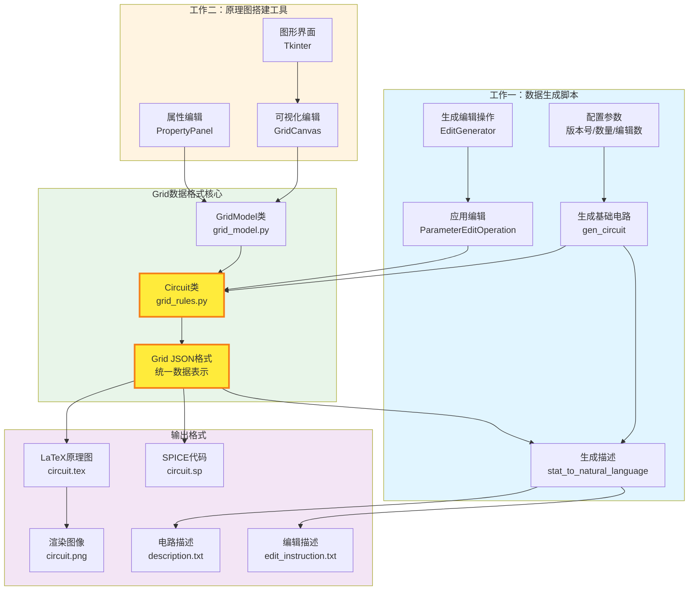
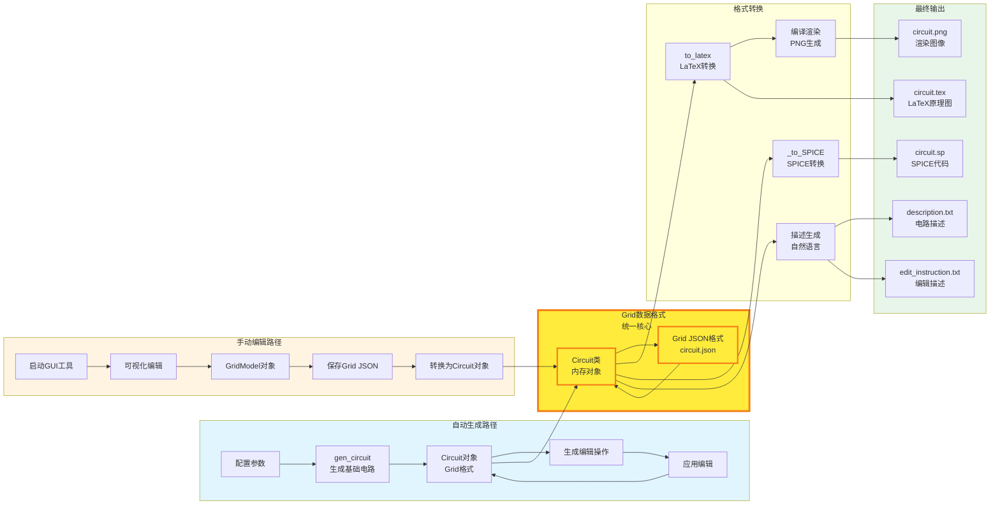
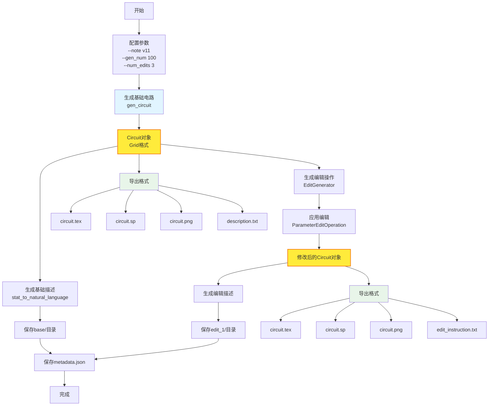
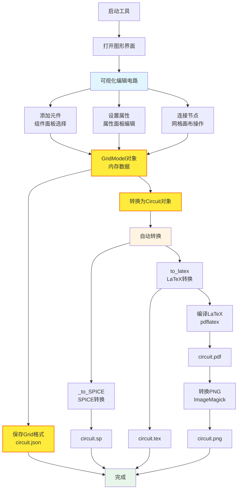
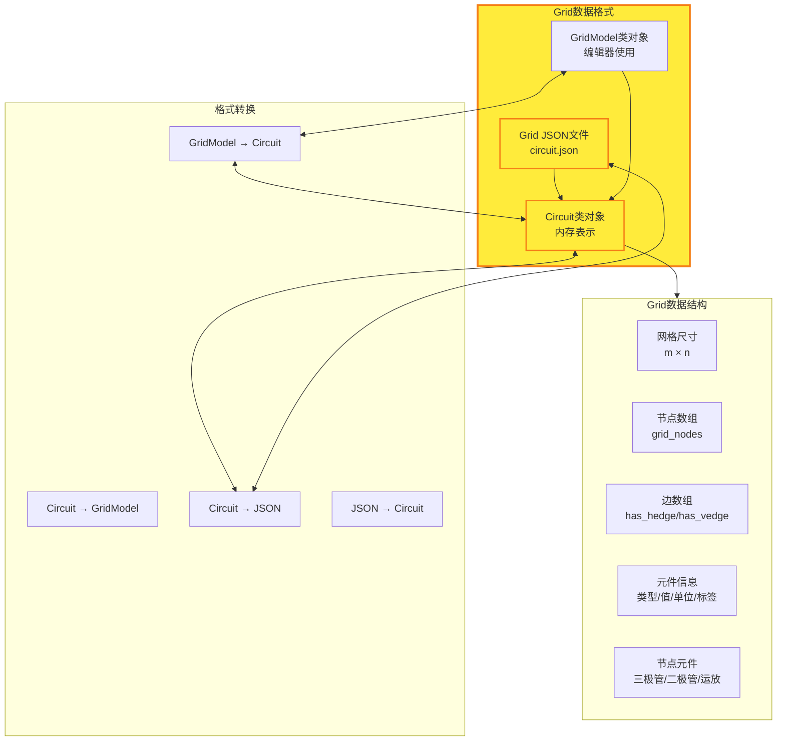
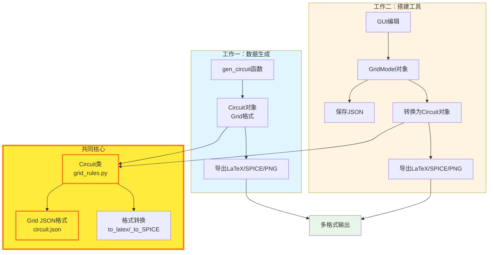
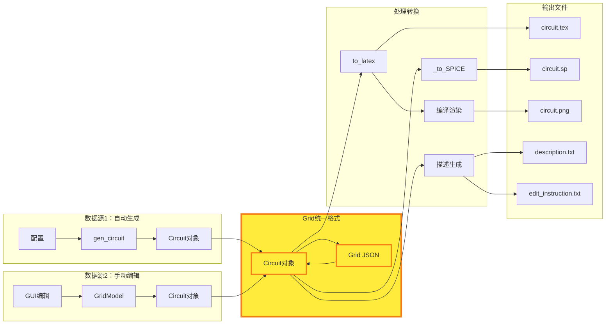
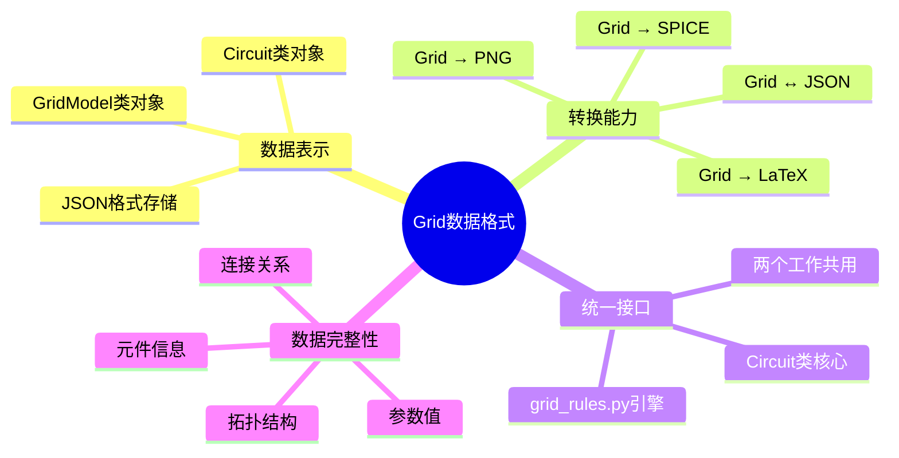
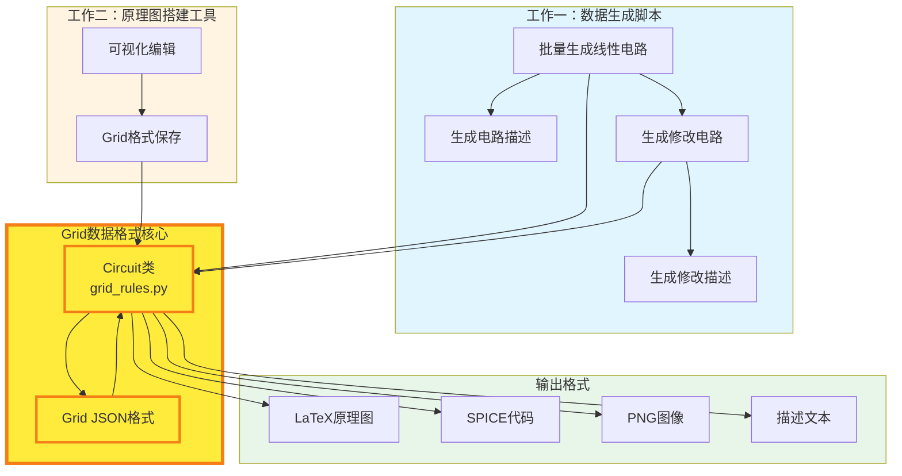

# MAPS项目工作介绍 - Mermaid版本

> 本文档包含所有Mermaid图表代码，可直接复制使用

---

## 1. 核心工作架构（统一视图）

---

## 2. 完整数据流图

---

## 3. 工作一：数据生成脚本流程

---

## 4. 工作二：原理图搭建工具流程

---

## 5. Grid数据格式结构

---

## 6. Grid格式连接两个工作

---

## 7. 完整数据流

---

## 8. Grid格式转换能力（思维导图）

---

## 9. 简化版：核心架构图

---

## 使用说明

### 方式一：在Markdown中使用
直接复制上述任意Mermaid代码块到Markdown文件中，支持Mermaid的编辑器会自动渲染。

### 方式二：在线渲染
1. 访问 [Mermaid Live Editor](https://mermaid.live/)
2. 复制Mermaid代码
3. 实时预览和导出

### 方式三：在文档中使用
- GitHub/GitLab：直接支持Mermaid渲染
- VS Code：安装Mermaid插件
- Notion/Obsidian：支持Mermaid语法

---

## 图表说明

1. **核心工作架构图**：展示两个工作如何通过Grid格式连接
2. **完整数据流图**：展示从输入到输出的完整流程
3. **工作一流程**：数据生成脚本的详细步骤
4. **工作二流程**：搭建工具的详细步骤
5. **Grid格式结构**：Grid数据格式的组成和转换
6. **Grid连接图**：展示Grid如何连接两个工作
7. **完整数据流**：简化的数据流向图
8. **思维导图**：Grid格式的能力总结
9. **简化架构图**：最简洁的核心架构

---

*最后更新: 2025年*

